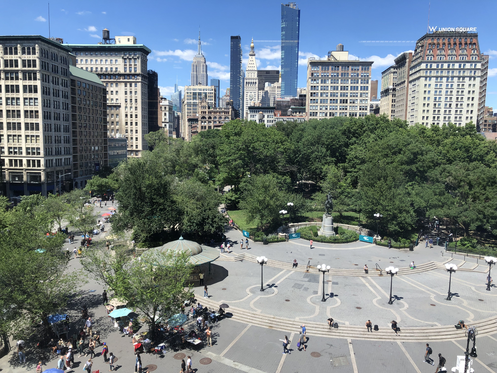
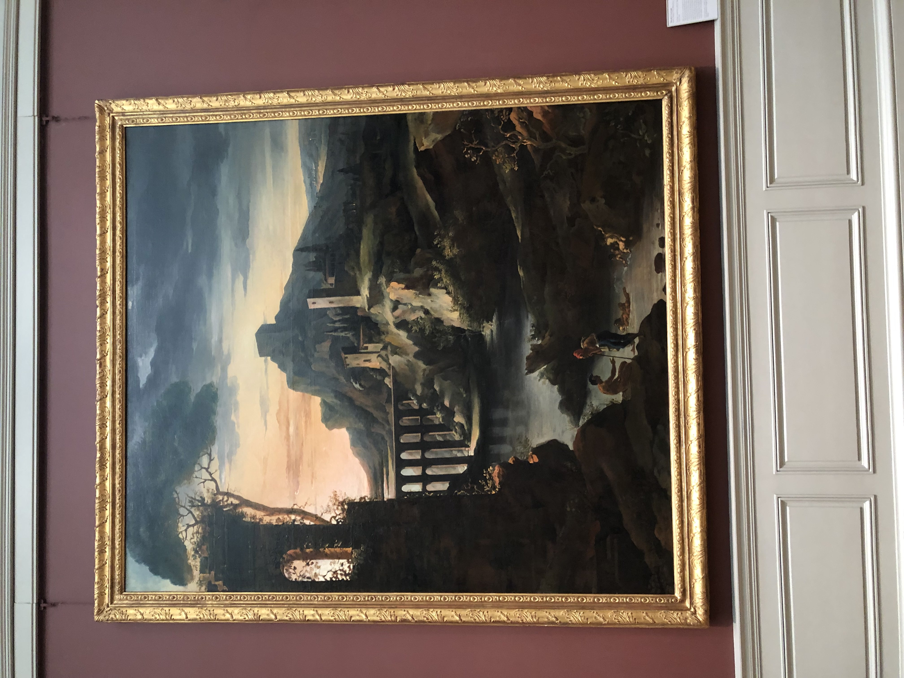
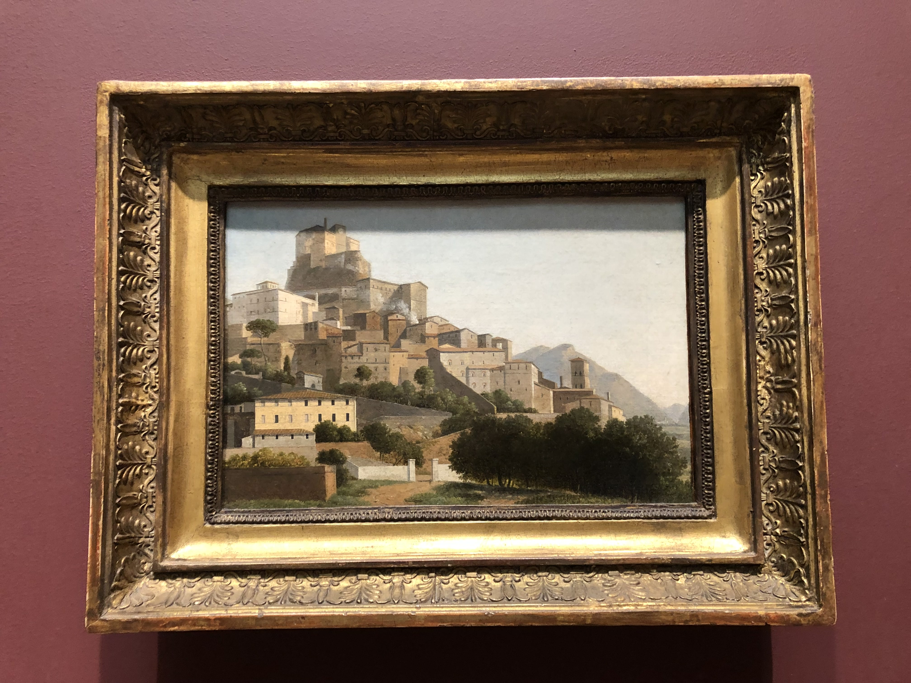
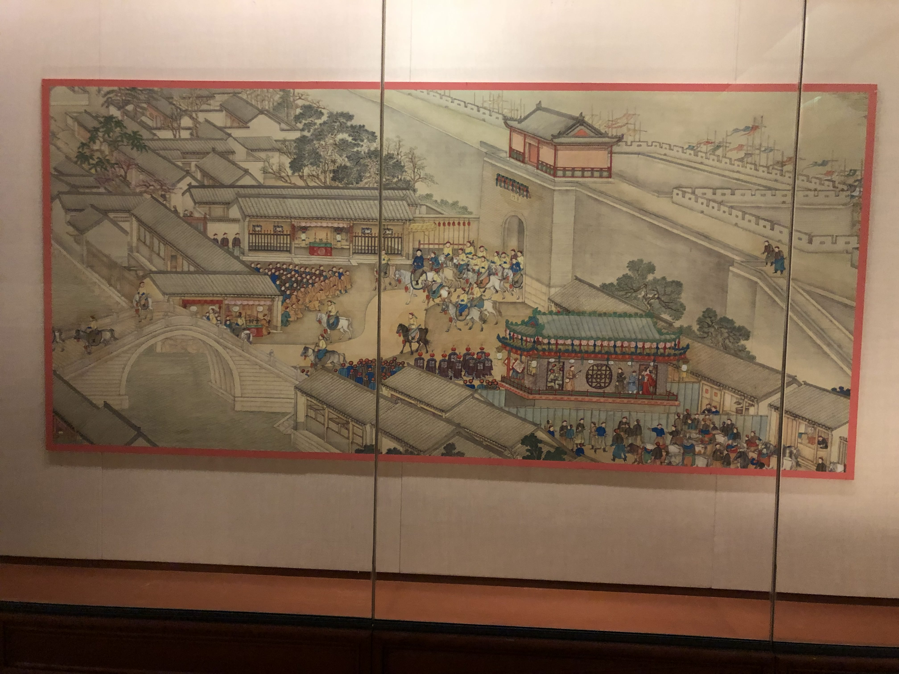
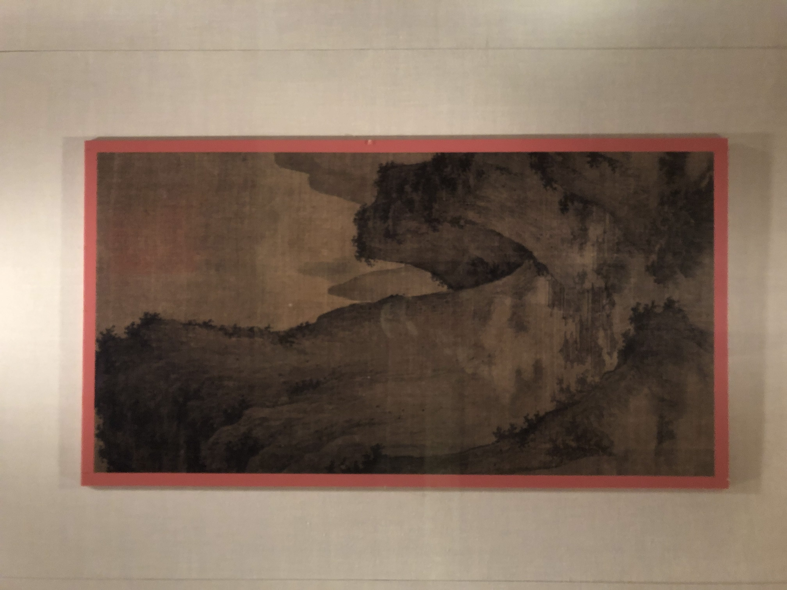
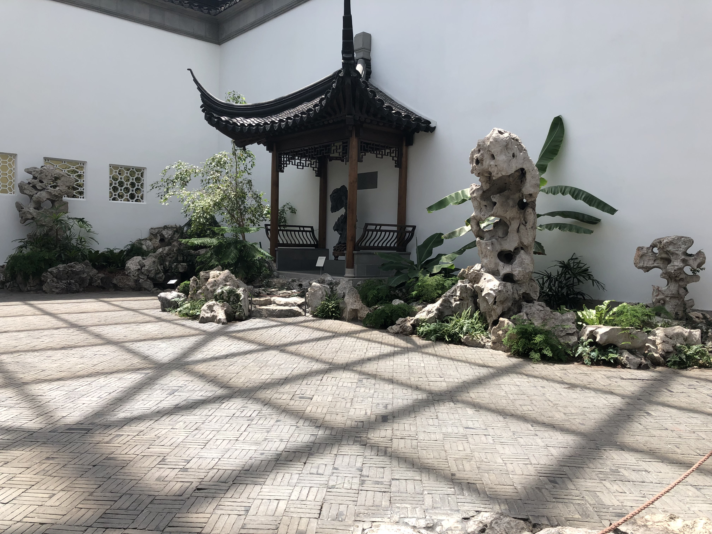

# NYC Trip 2021

## Categories
- [Food](#Food)
- [Museums](#Museums)
- [Entertainment](#Entertainment)
- [Lodging](#Lodging)
- [Transportation](#Transportation)
### Food
The food in NYC is unparalleled! With the sheer amount of amazing options available I found that my indecision was even worse than normal. However when I did decide I was almost always greeted with delicious food and amazing service. Here is the list of places I went to organized by day:

*Saturday 06/19/21*
- [Naya Mezze and Grill](https://www.nayarestaurants.com/) | Rating: 7/10 | Cuisine: Lebanese-Mediterranean
- [Ferrara Bakery & Cafe](http://www.ferraranyc.com/) | Rating: 6/10 | Cuisine: Italian Pastries

Had 2 tiramisu's here. The first one was very hard with a consistency like ice cream. The second was very soft like a normal tiramisu. While I think the first one was a mistake I liked it more than the second one. If I had a metal spoon it would have been a great dessert but my plastic spoon ruined the experience. Good tiramisu.

*Sunday 06/20/21*
- [Liberty Bagels](https://libertybagelsny.com/midtown/) | Rating: 8/10 | Cuisine: NYC Bagels

Liberty Bagels really showed me the value of giving restaurants a second try. The first time I went to Liberty Bagels was on *06/20/21* and I ordered an *Everything Bagel with Lox and Butter*. This was possibly one of the worst bagels I had ever eaten and I couldn't even finish the whole thing. However the next time I came back on *06/22/21* I ordered an *Everything Bagel with Salmon and Butter*. This was one of the best bagels I have ever eaten and was a solid bagel 10. If I hadn't come back to Liberty and tried the right thing then I never would have discovered my favorite bagels. Goes to show that you should give things a second try.
- [Spice Symphony](https://www.spicesymphony.com/50th-street/) | Rating 7.5/10 | Cuisine: Indo-Chinese

*Monday 06/21/21*
- [Taiyaki NYC](https://taiyakinyc.com/) | Rating: 9/10 | Cuisine: Japanese Dessert

The *Beach, Please* ice cream was some of the best I've ever had. It was the perfect blend of sweet and savory. On top of that the taiyaki was soft and pancake like. Wishing I could take this back to Houston with me.
- [Mamoun's](https://mamouns.com/) | Rating: 5/10 | Cuisine: Middle-Eastern
- [Kati Roll Company](https://www.thekatirollcompany.com/) | Rating: 4/10 | Cuisine: Indian

Both of these establishments have been around since my dad lived in NYC. However I think that they are somewhat overrated. Mamoun's shawarma was amazing but the pita sandwich was almost half or two-thirds lettuce. My dad liked it however so that's why it got a 5 and not a 4. The Kati Roll Company was a similar story with the roti's being thin and the chicken being very dry. This one gets a 4 because neither of us liked it.

*Tuesday 06/22/21*
- [Big D's Grub Food Truck](https://bigdsgrub.com/) | Rating: 7/10 | Cuisine: Tacos

*Wednesday 06/23/21*
- [Ten Ren's Tea Time](https://www.tenren.com/index.html) | Rating: 8/10 | Cuisine: Bubble Tea
- [Joe's Pizza](http://www.joespizzanyc.com/)

Joe's definitely lived up to the hype. I went there with my dad and together we ate a full pie. Afterwards, even with the filling slices, we were able to walk for almost 2 more miles. 

*Thursday 06/24/21*
- [Moustache](https://www.moustachepitza.com/) | Rating: 9/10 | Cuisine: Meditteranean

Moustache was an awesome experience in indecisiveness. With the sheer quantity of amazing food I was unable to decide on just one thing. We ordered the lamb and ouzi as well as many mezzeh plates. All of them were amazing and the service was excellent. If you visit NYC this is a must try.

*Friday 06/25/21*
- [Remi Flower and Coffee](https://www.reminyc.com/) | Rating: 8/10 | Cuisine: Coffee

As someone who's not a fan of the taste of coffee I really like Remi's. The iced maple latte was sweet enough for me and the avid coffee drinkers that were with me also loved their other drinks. Sadly I didn't get to go back a second time.
- [Patsys](https://www.patsys.com/) | Rating: 9/10 | Cuisine: Pizza

*Saturday 06/26/21*
- [Flame Diner](https://www.theflamediner.com/Welcome.tpl) | Rating: 9/10 | Cuisine: American

One of the best diners I've ever been to. Definitely not your garden variety Dennys or IHOP. Loved the eggs and would definitely go back a second time. The desserts looked to good to be true.
- [Brooklyn Ice Cream](https://www.brooklynicecreamfactory.com/) | Rating: 7/10 | Cuisine: Ice Cream
- [Yama Ramen and Sushi](http://yamaramen.com/) | Rating: 7/10 | Cuisine: Japanese

*Sunday 06/27/21*
- [Buddha Bodai](https://www.buddha-bodai.com/) | Rating: 9/10 | Cuisine: Vegetarian

Some of the most convincing imitation vegetarian food I've ever had. I didn't even realize that the General Tso's chicken was vegetarian until I was told after the meal by my dad. Delicious food and a great spot to visit with vegetarian people.
### Museums
My interests, as of late, have been centered around art and philosophy. Accordingly during this trip I visited two art museums as well as Strand Book Store, which is pretty close to being a museum.

 *The Met*
Of the two art museums I went to the Met was my favorite. Roaming throughout the galleries I got to see most of the different exhibitions. My personal picks were the 1250-1800 European gallery and the Asian art section. The European gallery featured some beautiful painting that were very photorealistic and depicted interesting events. Here are some of my personal favorites from this section:

When I went to the Asian art gallery it began with mostly sculptures and very old artifacts. However, as you got deeper into the gallery you got to see an ornate garden as well as beatiful paintings of gorgeous scenes, among other things. Here are some of my personal favorites from this section:

The Japanese Garden: 

  *The MoMA*
The MoMA was a very interesting museum. While it wasn't nearly as extensive as the Met, it showed me much more variance within the modern art genre. However, since I'm not a fan of the modern art genre it was slightly disappointing.

### Entertainment
The entertainment scene in NYC is unbelievable. However due to the fact that I'm 15, my options at night were limited. Despite this we were able to find amazing things to do in the city after dark. Our first outing was to the Blue Note Jazz Club where we saw Jacob Collier & Friends. This was a truly mind-blowing experience and as someone who hadn't listened to live jazz before that I was awestruck. The service was also great here. 10/10, definitely coming back when I'm in the city next. 

The next outing we took was to the New York Comedy Club. The lineup here was great, we had Tom Cassidy, Akaash Singh, and Mark Feeney among others. I had a great experience here and wouldn't hesitate to go back. The comedians were top notch and service was excellent. 
### Lodging
From *6/19 to 6/21* we stayed at the [Heritage Hotel](https://www.heritagehotelnyc.com/). The hotel service was good and the rooms fit the 3 of us. However, the door to the bathroom in our first room didn't lock and once we were moved into a second room the bathroom door didn't have a lock. The Heritage is good if you have multiple people traveling with you as some rooms can accommodate 3 twin beds for a good price. However this is not a luxury hotel by any means. 

For the remainder of our trip we stayed with my cousin in Midtown East.
### Transportation
New York, being a very compact city, is easy to traverse through a variety of means. Here are the ones that we did:

*Biking*  
We took electric Citi bikes twice in the trip. The first time we took ebikes from Union Square all the way to 44th street. This trip was quite easy due to the ebikes we were riding however biking in traffic isn't the safest especially without bike lanes and helmets. The second time we took ebikes was from Columbus Circle/Lincoln Center. We took the bikes along the Westside Highway bike trail all the way across the Brooklyn Bridge and finally to the Brooklyn Pier. This trip took us about 105 minutes however this included significant delays in trying to find the bike on ramp that led to us almost entering the car intake ramp. 

Citi's Ebikes are a very easy way to get around the city. However, it isn't the most economical at 0.18$ a minute plus a 3.50$ undocking fee. If you are looking for a leisurely tour of the city then Citi Bikes are for you.

*Subway*  
We took the subway many times from Midtown to Canal St, Wall St, etc. These trips weren't notable and have been the cheapest method of travel in the city, next to walking.

*Uber*  
We took Uber's for the majority of our longer distance journeys. The experience was always pleasant and drivers were very friendly. This was the most expensive travel option however it was also the most efficient. If you need to be somewhere ASAP then Uber is what you should take.

*Walking*  
Most of our shorter trips were done by walking and we also took a longer trip from Wall St up to Houston St. This trip was excellent and we got to see the various sights along the way. If you don't need to go very far then walking is always the cheapest and best option. However if it is dark you should exercise caution especially when your off of a main road. 